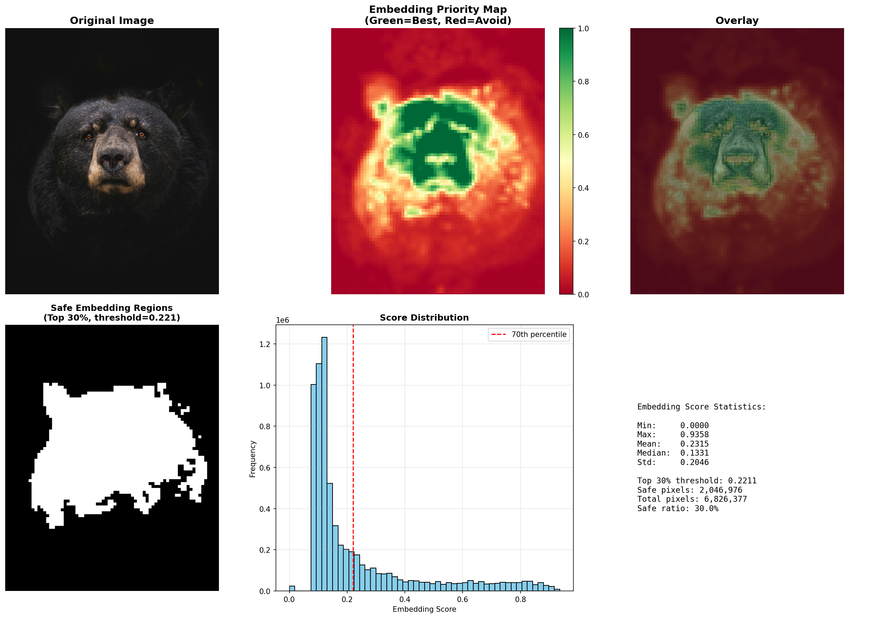
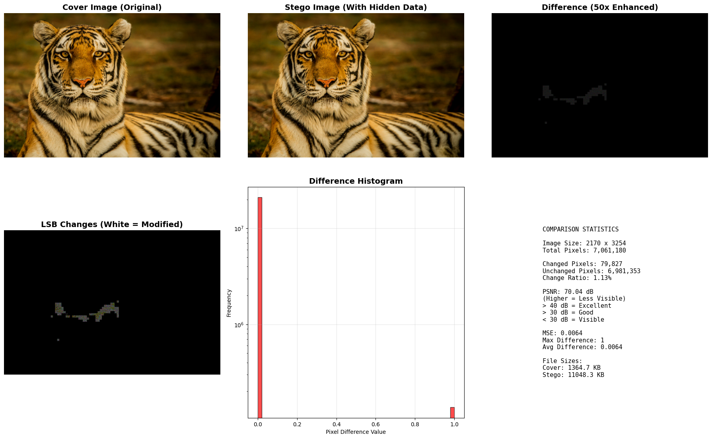

# StegoNet: Adaptive Image Steganography using Deep Learning

StegoNet is a deep-learning assisted steganography system that hides textual data inside images while maintaining high visual quality.

Instead of embedding data uniformly across the image, the system uses a convolutional neural network to identify **high-texture regions where modifications are less perceptible to the human eye**.

By embedding information only in these adaptive regions, the system achieves **higher imperceptibility and improved robustness** compared to naive LSB steganography.

This project was developed as a **college project (B.Tech Computer Science & Engineering)**.  
Further technical details are available in the accompanying research paper.

---

# Example Results

## Embedding Priority Map

The StegoNet CNN analyzes the image and produces an **embedding priority map**, highlighting regions that are safer for hiding information.

Green areas represent **high-texture regions suitable for embedding**, while red areas should be avoided.

---

## Cover vs Stego Image

After embedding the secret message, the stego image appears visually identical to the original image.

The difference visualization highlights the **small pixel modifications introduced during LSB embedding**.

These results demonstrate that the hidden message can be embedded while maintaining **very high image quality and minimal visible distortion**.

---

# Overview

Traditional LSB steganography hides data by modifying the least significant bits of pixel values.  
However, uniform embedding can introduce detectable patterns.

StegoNet improves this approach by first analyzing the image using a trained CNN that predicts **embedding suitability scores** for different regions of the image.

## Workflow

1. The CNN analyzes the image and generates an **embedding priority map**
2. Pixels in **high-texture regions** are selected based on a percentile threshold
3. The secret message is embedded using **adaptive LSB substitution**
4. The decoder uses the same embedding map to extract the hidden message

This allows the system to hide **large messages while keeping image distortion minimal**.

---

# Model Architecture

The StegoNet model is a convolutional neural network designed to evaluate **image texture and structural complexity**.

## Key Components

- Multi-layer convolutional feature extraction
- Batch normalization and ReLU activations
- Multi-scale feature aggregation using
  - Global Average Pooling
  - Global Max Pooling
- Fully connected regression head predicting **embedding suitability scores**

The model outputs a **priority score for each image patch**, indicating how safe it is to embed data in that region.

---

# Training Data

The model was trained using the **COCO 2017 dataset**, a large-scale dataset containing diverse real-world images.

During training, the network learns to identify **high-texture areas and structural patterns** that naturally conceal small pixel modifications.

These areas are more resistant to **perceptual detection and statistical steganalysis**.

---

# Features

- Adaptive steganography guided by deep learning
- CNN-based embedding priority map
- Texture-aware message embedding
- High image quality preservation
- Visualization of embedding regions
- Capacity analysis and PSNR evaluation
